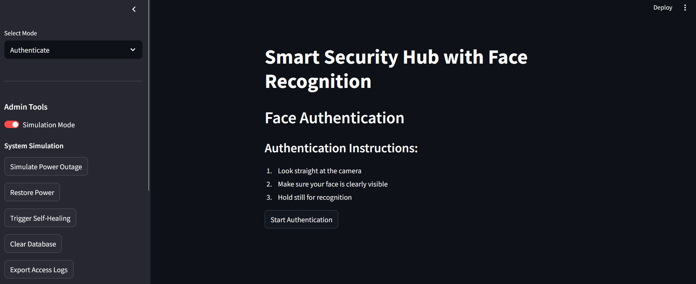
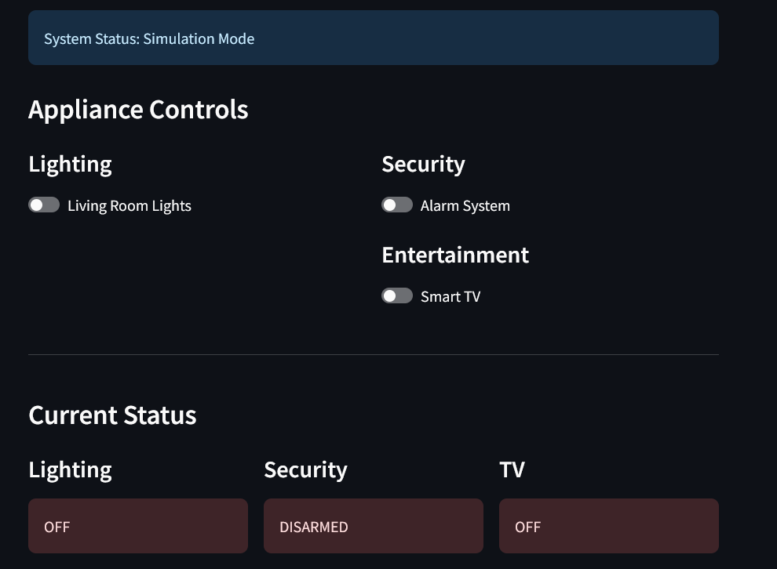
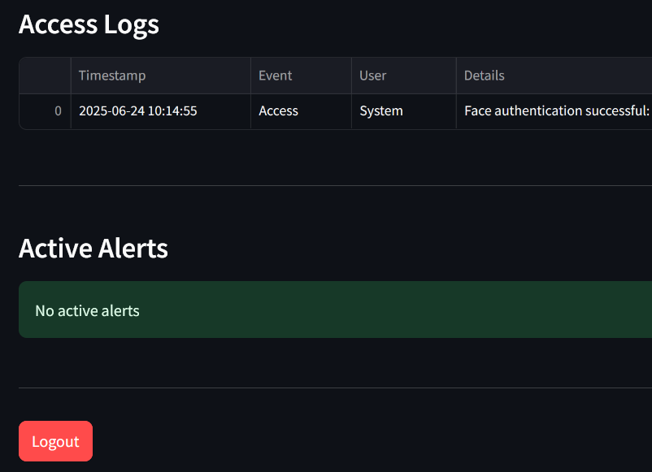
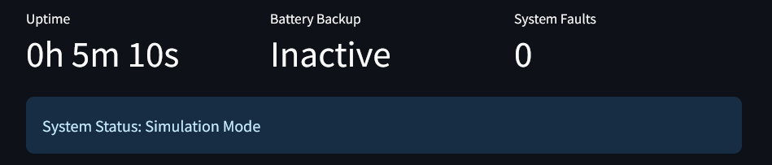

---
A **Streamlit-based multi-authentication security system** that integrates **Face Recognition**, **PIN Authentication**, and **RFID (Demo Mode)** for secure access control.
Includes an **Admin Control Panel** for appliance management, logging, simulation controls, and fault tolerance features.
---

## 📌 Features

- **Face Recognition Authentication** using YOLOv8 and dlib.
- **PIN-based Access** as an alternative login method.
- **RFID Authentication (Demo Mode)** for demonstration purposes.
- **Face Registration (Admin Only)** with password protection.
- **Smart Home Control Panel** to manage appliances (lights, alarm, smart TV).
- **Simulation & Real Mode Switching** for device control.
- **Logging & Alerts** for security events.
- **Self-Healing & Fault Tolerance** for camera and power failures.

---

## 📸 Screenshots

|  |  |
| :----------------------------------: | :------------------------------------------: |
| _Main authentication & status view_  |     _Smart-home appliance control panel_     |

|  |  |
| :---------------------------------------: | :---------------------------------------------: |
|          _Access-log dashboard_           |       _Real-time system status & alerts_        |

---

## 🖥 Prerequisites

- **Windows 10/11 (64-bit)** or **macOS/Linux** (with minor path changes)
- **Python 3.13.3** (added to PATH)
- **Webcam** (built-in or USB)
- **Visual Studio Code** with Python extension installed

---

## 📂 Project Structure

```
project/
├── app.py                  # Main Streamlit application
├── requirements.txt        # Python dependencies
├── yolov8n-face.pt         # YOLOv8 face-detection weights
└── face_database.pkl       # (auto-created) face encodings database
```

---

## ⚙️ Setup in VS Code

1.  **Open the Project**
    `File` → `Open Folder…` → Select your project folder

2.  **Create & Activate Virtual Environment**

    ```bash
    python -m venv venv
    .\venv\Scripts\Activate
    ```

3.  **Install dlib**

    ```bash
    pip install https://github.com/omwaman1/dlib/releases/download/dlib/dlib-19.24.99-cp313-cp313-win_amd64.whl
    ```

4.  **Install Other Dependencies**

    ```bash
    pip install -r requirements.txt
    ```

### ▶️ Running the App

```bash
streamlit run app.py
```

Your browser will open at `http://localhost:8501/`.
If it doesn’t open automatically, copy-paste the URL into your browser.

---

## 🔑 Authentication Methods

1.  **Face Recognition**

    - Select `Authenticate` mode in the sidebar.
    - Click `Start Authentication`.
    - Face the camera, keep still, and follow instructions.
    - On success, you’ll be redirected to the Home Control Panel.

2.  **PIN Access**

    - Select `PIN Access` mode.
    - Enter your 6‑digit PIN.
    - Click `Authenticate with PIN`.

3.  **RFID Access (Demo Mode)**

    - Demo for RFID authentication.

---

## 🛠 Admin Features

- **Face Registration (Admin Only)**

  - Select `Register Face` in the sidebar.
  - Enter Admin Password.
  - Provide a username.
  - Click `Start Face Scan` and follow instructions.

- **Home Control Panel**

  - **Appliance Controls**: Toggle lights, alarm system, and smart TV.
  - **Status Display**: Appliance states, access logs, and active alerts.
  - **Simulation Mode Toggle**: Switch between real and simulated mode.
  - **System Simulation Controls**: Simulate power outage, restore power, trigger self-healing.
  - **Database Management**: Clear registered faces, export logs as CSV.

---

## 📜 Logging & Alerts

- **Access Logs**: Stored in `access_log.csv`.
- **Alerts**: Info, warning, and critical alerts with manual acknowledgment.
- **Self-Healing**: Restores camera and power functionality automatically.

---

## ❗ Troubleshooting

| Symptom                                 | Fix                                                                      |
| :-------------------------------------- | :----------------------------------------------------------------------- |
| **No camera detected**                  | Close other apps using the webcam; check webcam drivers.                 |
| **dlib installation errors**            | Ensure Python 3.13.3 is installed, then install dlib as shown.           |
| **Pickle load/save errors**             | Delete `face_database.pkl` and retry registration.                       |
| **“Running scripts is disabled” error** | Run `Set-ExecutionPolicy RemoteSigned -Scope CurrentUser` in PowerShell. |
| **Poor face detection**                 | Improve lighting, remove glasses, keep face centered in frame.           |

---

## 🤝 Contributing

Contributions, issues, and feature requests are welcome.

Fork the repo, create a branch, make your changes, and submit a pull request.

---
